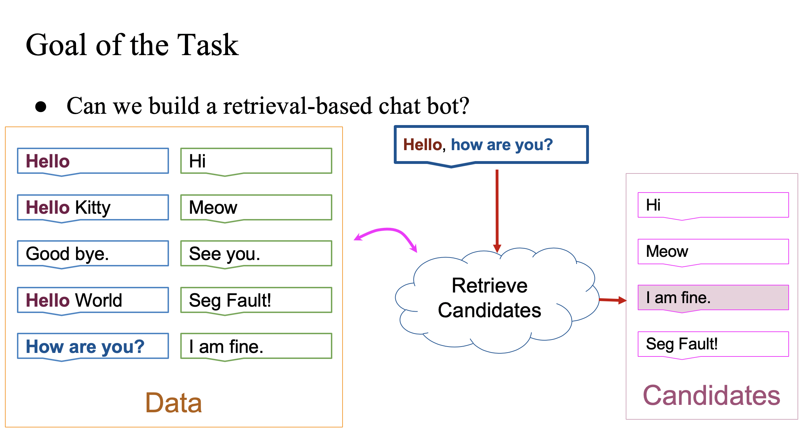
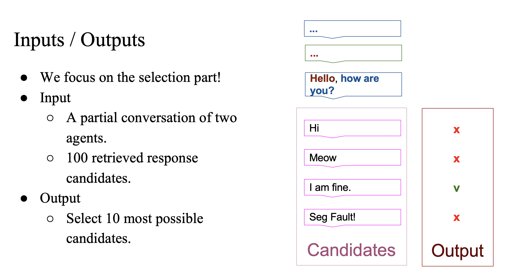
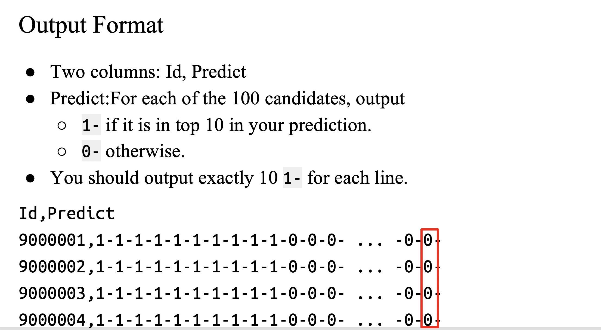

# Introduction
- **Task Discription:**


---



---



#How to run

1. Prepare the dataset and pre-trained embeddings (FastText is used here) in `./data`: 

```
./data/train.json
./data/valid.json
./data/test.json
./data/crawl-300d-2M.vec
```

2. Preprocess the data
```
cd src/
python make_dataset.py ../data/
```

3. Then you can train a poooor example model as follow:
```
python train.py --device cuda:0 ../models/example/
```

4. To predict, run
```
python predict.py ../models/example/ --epoch 3
```
where `--epoch` specifies the save model of which epoch to use.
